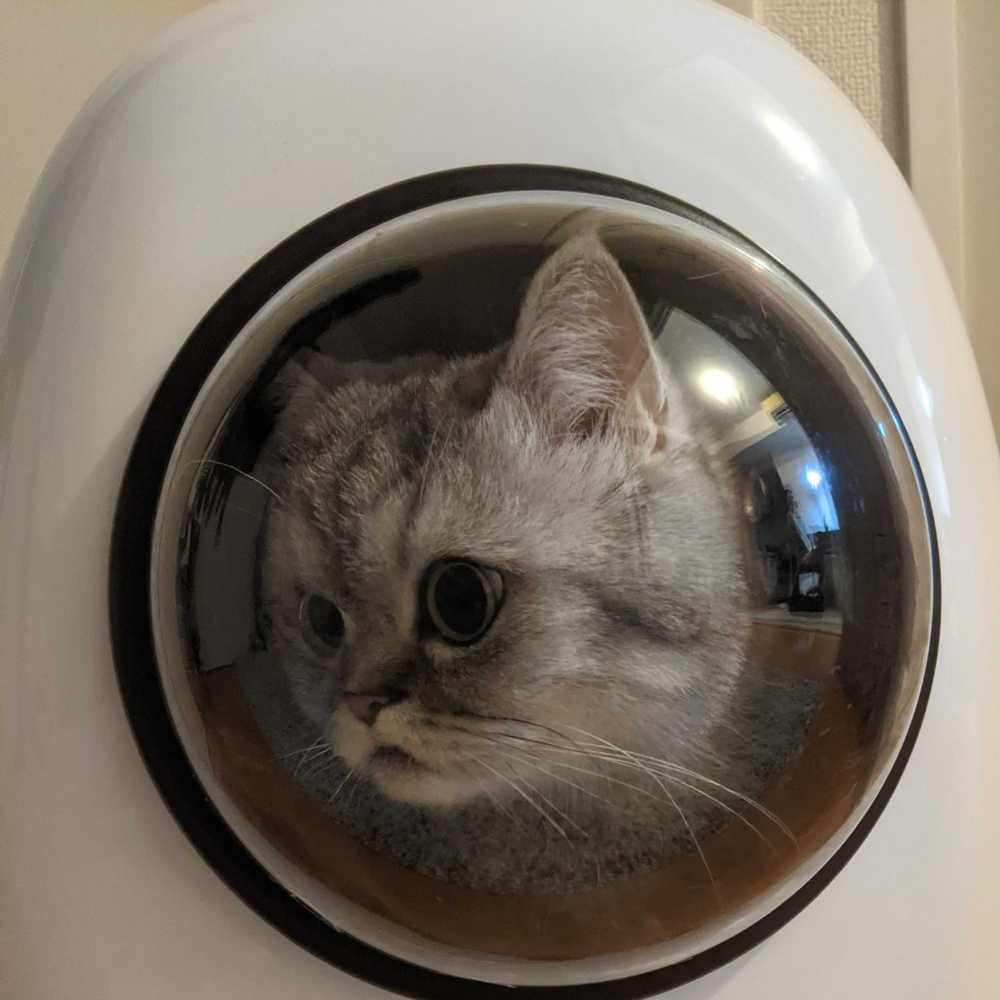

Katacoda上でFlaskアプリケーションを作成して実行します。
まずはflaskをインストールします。

`pip install flask`{{execute}}

準備ができたら、`app.py`{{open}} にコードを書いていきましょう。
初めに、モジュールのインポートをします。
<pre class="file" data-filename="app.py" data-target="replace">from flask import Flask
</pre>
続いて、アプリケーション本体を記述します。
<pre class="file" data-filename="app.py" data-target="append">app = Flask(__name__)

@app.route("/")
def hello_world():
    return "
Hello, World!
"
</pre>

これで完成です最後は動かしてみましょう。
`export FLASK_APP=hello`{{execute}}
`flask run --host=0.0.0.0 --port=8000`{{execute}}

タブで確認してね.
